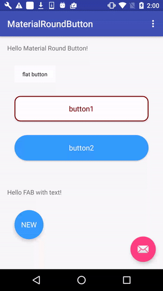

# MaterialRoundButton

A material design button that enables ripple effect, dynamic shadow and supports round corners, adding border. Supports only text as content for the moment.

## How to use it

Add following to your build.gradle

    repositories {
        maven {
            url  "https://dl.bintray.com/karlgao0811/MaterialRoundButton"
        }
    }

    dependencies {
        compile 'com.karlgao.materialroundbutton:materialroundbutton:1.0.0'
    }

Add following to your layout file:

*default value will apply if you don't specify the attribute*

    <com.karlgao.materialroundbutton.MaterialButton
            android:layout_width="match_parent"
            android:layout_height="56dp"        //minHeight is set to 16dp
            app:mb_borderColor="#800000"        //default:"#606060"
            app:mb_borderWidth="2dp"            //default:"0dp"    
            app:mb_buttonColor="#00000000"      //default:"#606060"
            app:mb_buttonType="raised"          //default:"raised"; option:"flat","raised","fab"
            app:mb_cornerRadius="12dp"          //default:"0dp"  
            app:mb_rippleColor="#800000"        //default:"#40000000"
            app:mb_text="button1"               //default:"DEMO"
            app:mb_textColor="#800000"          //default:"#de000000"
            app:mb_textSize="16sp"              //default:"16sp"
            />

License
-------

    Copyright 2015 Vincent Mi

    Licensed under the Apache License, Version 2.0 (the "License");
    you may not use this file except in compliance with the License.
    You may obtain a copy of the License at

       http://www.apache.org/licenses/LICENSE-2.0

    Unless required by applicable law or agreed to in writing, software
    distributed under the License is distributed on an "AS IS" BASIS,
    WITHOUT WARRANTIES OR CONDITIONS OF ANY KIND, either express or implied.
    See the License for the specific language governing permissions and
    limitations under the License.
